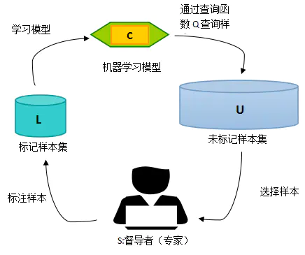

# 【关于 主动学习】 那些你不知道的事

> 作者：杨夕
> 
> 项目地址：https://github.com/km1994/nlp_paper_study
> 
> 个人介绍：大佬们好，我叫杨夕，该项目主要是本人在研读顶会论文和复现经典论文过程中，所见、所思、所想、所闻，可能存在一些理解错误，希望大佬们多多指正。

## 目录

- [【关于 主动学习】 那些你不知道的事](#关于-主动学习-那些你不知道的事)
  - [目录](#目录)
  - [什么是 Active Learning？](#什么是-active-learning)
  - [解决什么问题？](#解决什么问题)
  - [价值？](#价值)
  - [主动学习方法](#主动学习方法)
    - [方法思路](#方法思路)
    - [方法类型](#方法类型)
      - [基于不确定性的方法](#基于不确定性的方法)
        - [思想](#思想)
        - [流程](#流程)
        - [代表方法](#代表方法)
      - [基于委员会查询的方法（Query-By-Committee，QBC）](#基于委员会查询的方法query-by-committeeqbc)
        - [思想](#思想-1)
        - [流程](#流程-1)
        - [代表方法](#代表方法-1)
        - [计算公式](#计算公式)
  - [参考](#参考)

## 什么是 Active Learning？

- 类型：机器学习算法
- 思路：
  - 通过主动找到最有价值的训练样本加入训练集，如果该样本是未标记的，则会自动要求人工标注，然后再用于模型训练；
- 目标：以更少的训练样本训练出性能尽可能高的模型；

## 解决什么问题？

- 数据标注成本高，尤其是专业知识领域；
- 数据量巨大，难以全量训练 ，或训练机器/时间有限；

## 价值？

- 主动学习能减少样本标注量来节约成本，包括标注成本和训练资源成本；并且主动学习能在同等数据量下提升模型性能。

> 未标注的样本池有1000w个样本，应用主动学习从中挑出200w样本进行标注后训练，便能训练出性能与1000w训练相当的模型。通常认为，主动学习能减少一半以上的样本标注量。有时主动学习挑选数据集子集进行训练，模型性能能超越全量训练。

## 主动学习方法

### 方法思路

- 公式

$A=(C,Q,S,L,U)$

> C 为一组或者一个分类器;
> L是用于训练已标注的样本;
> Q 是查询函数，用于从未标注样本池U中查询信息量大的信息;
> S是督导者，可以为U中样本标注正确的标签。

- 流程
  - 学习者通过少量初始标记样本L开始学习；
  - 通过一定的查询函数Q选择出一个或一批最有用的样本，并向督导者询问标签；
  - 然后利用获得的新知识来训练分类器和进行下一轮查询；
  - 主动学习是一个循环的过程，直至达到某一停止准则为止。

### 方法类型

- 基于不确定性的方法：挑选对当前模型不确定性最大的样本作为训练数据；
- 基于委员会查询的方法：通过挑选对不同模型最具不确定性的样本作为训练数据；

#### 基于不确定性的方法

##### 思想

不确定性越大，蕴含信息量越大，越有训练价值；

##### 流程

- 用已打标的数据子集训练模型，用该模型预测剩余未打标样本；
- 根据预测结果使用不确定性衡量标准找出最不确定的样本；
- 交给打标人员标注；
- 加入训练集训练模型，再用该模型进行数据挑选，反复迭代；
  
##### 代表方法

- least confident（LC）
  - 关注模型预测时置信度值很大，“可信度”依旧很低的样本；
  - 缺点：没关注易混淆的样本；
  - 公式：

> P(yi|x)：样本 x 分类为 yi 的概率，即模型输出的 score 值；

- smallest margin(SM)
  - 关注置信度最大的两个值的差（margin）最小的样本，即易混淆的样本，该方案是针对LC的缺点进行的改进。
  - 公式

> P(y1|x)：样本 x 分类为 y1 的概率，即模型输出的 score 值； 
> P(y2|x)：样本 x 分类为 y2 的概率，即模型输出的 score 值； 

- entropy（ENT）
  - 关注综合信息量最大的样本
  - 公式：
  

#### 基于委员会查询的方法（Query-By-Committee，QBC）

##### 思想

将优化ML模型看成是版本空间搜索，QBC通过压缩版本空间的搜索范围，找到最优秀ML模型。

##### 流程

相同训练集训练多个同结构的模型，模型投票选出争议样本，将争议样本打标后训练模型，反复迭代。

##### 代表方法

- 2～3个模型组成的Committee就能获得不错的性能，diversity是集成模型性能的关键[1]：
  - H.S. Seung[2]于1992首次提出QBC方法，通过多个模型对分类结果进行投票，选出投票结果最不一致的样本。
  - DAS[3],2019年发表于arXive,基于深度神经网络版本的QBC方法：两个一样结构的VGG-16网络，在相同数据集上训练，挑出判别不一致的样本。
  - Active-Decorate[4]方法：基于QBC挖掘回新数据，打标后加入训练集训练一个新增分类器，与已有模型直接集成为committee，再基于新的committee继续挑选新数据，反复迭代。

##### 计算公式

> C 分类类别数；
> Vot(yi) 是 类别 yi 所获得票数；
 

## 参考

1. [主动学习方法实践：让模型变“主动”](https://developer.aliyun.com/article/766940)

