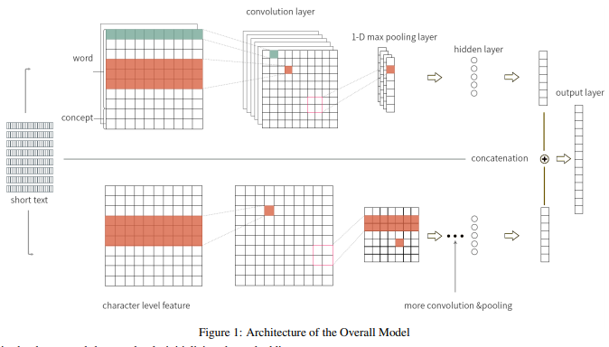

# 【关于 Knowledge in TextCNN】那些你不知道的事

> 作者：杨夕
> 
> 论文： Combining Knowledge with Deep Convolutional Neural Networks for Short Text Classification
> 
> github：https://zhuanlan.zhihu.com/p/183852900

## 摘要

- 介绍：文本分类是NLP应用程序中的一项基本任务。 现有的大多数工作都依靠显式或隐式文本表示来解决此问题。 
- 问题：虽然这些技术对句子很有效，但由于其简短和稀疏，因此无法轻松地应用于短文本。
- 方法：提出了一个基于卷积神经网络的框架，该框架结合了短文本的显式和隐式表示形式进行分类
  - 首先使用大型分类学知识库将短文本概念化为一组相关概念。 
  - 然后，通过在预训练的单词向量之上合并单词和相关概念来获得短文本的嵌入。 
  - 我们进一步将字符级功能集成到模型中，以捕获细粒度的子词信息。 
- 实验结果：在五个常用数据集上的实验结果表明，我们提出的方法明显优于最新方法。

## 引言

- 问题：
  - 与段落和文档不同，短文本不能总是获得 神经语言 特征；
  - 短文本 上下文 缺乏；
  - 短文本通常比较模棱两可，因为它们包含多义和错别字。

- 文本表示模型分类：
  - Explicit（显式） Representation：
    - 介绍：对于显式方法，给定的文本将按照传统的NLP步骤建模，包括分块，标记和语法分析。 研究人员从许多方面创建有效的功能，例如知识库，POS标记和依赖项解析；
    - 问题：
      -  尽管人类很容易理解显式模型，但该机器很难收集有用的特征以进行歧义消除；
      -  还遭受数据稀疏性问题的困扰；
   - 举例：当知识库中缺少某个实体时，我们无法获得其任何功能，因此显式表示将无法正常工作。
  - Implicit Representation：
    - 介绍：在隐式表示方面，文本使用神经语言模型（NLM）表示[Bengio等，2003]。 NLM将文本映射到隐式语义空间，并将其参数化为向量。 隐式表示模型可以从上下文中捕获更多信息，并借助深度神经网络促进文本理解。 
    - 问题：
      - 它们在新词和稀有词上的表现不佳；
      - 他们忽略了同时出现的重要关系，例如IsA和IsPropertyOf。
    - 举例：“安格斯”赢得世界大赛的文字中的“安格斯”一词就是棒球队的名字。 但是，隐式模型无法捕获有关Angles是棒球队的信息，并将其视为动物或新词。 我们需要更多的知识来填补这一空白。

- 对于短文本分类，单独使用显式或隐式表示是无效的。 
  - 对于显式模型，短文本中的语法和语义信息对于传统的NLP方法捕获来说太微妙了。 有时隐式模型也不能很好地工作。 
    - 在许多实际应用中，诸如专有名词之类的稀有词经常出现在短文本中。 
    - 此外，正如之前的工作[Hua et al。，2015]所述，隐式模型中缺少的IsA关系对于理解短文本至关重要。 
- 但显式和隐式表示却是互补的，如先前的工作所示[Hu et al。，2016]：诸如逻辑规则之类的显式知识可以集成到深度神经网络中，以调节学习过程。 我们可以将它们结合起来，将显式知识转换为神经模型。

## 方法

- 提出了一个深度神经网络，该网络将短文本的显式和隐式表示进行融合。
  - 首先借助明确的知识库来丰富短文本的信息。 具体来说，我们在知识库中将每个短文本与其相关概念相关联。 
  - 接下来，我们将单词和短文本的相关概念结合起来，以使用预训练的单词嵌入来生成其嵌入。 
  - 然后，我们将此词概念嵌入到卷积神经网络（CNN）中，以从联合嵌入中学习显式知识。 据我们所知，这是将显性和隐性表示相结合以实现短文本理解的第一部作品。

## 模型介绍

### Short Text Conceptualization

- 知识库选择：Probase
  - 优点：
    - Probase 对有关文字事实的概念的涵盖范围更广。 
    - Probase包含概率信息，通过这些信息我们可以量化短文本的许多度量，例如受欢迎程度，典型性和分类。 
    - 通过利用Probase中的大量IsA关系，我们可以获得概念列表以及它们与短文本的相关性。

- concept vector
  
$$
    C = {<c_1,w_1>,....<c_k,w_k>}
$$

> $c_i$：知识库的 语义；
> $w_i$：是一个权重，表示与 $c_i$ 相关的短文本的相关性；

### Overall Architecture of the Model

得到概念化的结果之后，我们可以将概念的知识与短文本的嵌入结合起来。 对于词和概念嵌入，我们使用预训练的词嵌入并使其保持静态。 但是由于没有针对字符级别的预训练嵌入，因此我们应该允许在训练过程中修改字符的嵌入。 这样，可以在训练模型时很好地调整字符嵌入。 

- 提出了如图1所示的两分支模型。它具有两个组成部分：
  - 上部子网用于短文本的单词和概念嵌入；
  - 下部子网用于字符嵌入。 
- 它们都是CNN。 使用这种模型，我们可以分别从单词级别和字符级别学习丰富的功能。
上部组件由七个层组成：一个输入层，两个卷积层，两个池化层和两个隐藏层。

#### Input Layer

- The input layer transforms the short text into a matrix of embedding, denoted as W

> 连接 词嵌入 和 概念嵌入

#### Convolution Layer

卷积层的功能是从输入矩阵中提取更高级别的特征。 为了获得不同种类的功能，我们应用了不同大小的过滤器。

#### Pooling Layer

池化层的功能是通过汇总每个过滤器的分数来进一步抽象从卷积层生成的特征。 在这项工作中，我们对每个要素地图应用了最大时间池化操作。 想法是在向量的每个维度上选择最大值以捕获最重要的特征。 通过池化层，我们可以从特征图中得出固定长度的向量。

#### Hidden Layer

为了充分利用从池化层获得的丰富功能，我们使用非线性隐藏层来组合不同的池化功能。 在我们的工作中，我们将tanh用作激活函数。 在这一层中，我们还可以通过将特征向量元素的比例随机设置为零，将缺失[Hinton et al。，2012]作为均化的平均值。